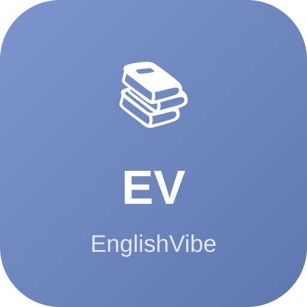

# 📚 EnglishVibe - 初中英语单词学习助手

<p align="center">
  
</p>

<p align="center">
  <strong>让背单词变得轻松有趣！</strong>
</p>

<p align="center">
  <a href="#功能特点">功能特点</a> •
  <a href="#在线体验">在线体验</a> •
  <a href="#快速开始">快速开始</a> •
  <a href="#安装到手机">安装到手机</a>
</p>

---

## ✨ 功能特点

### 🎯 专为初中生设计
- **2276个精选词汇** - 覆盖初一、初二、初三全部核心词汇
- **严格筛选** - 不含小学词汇，专注初中阶段
- **例句辅助** - 每个单词配套例句，理解更深刻

### 🔊 真人发音
- **有道词典真人发音** - 清晰标准的美式/英式发音
- **单词读两遍** - 加深印象
- **例句朗读** - 学习地道表达

### 📅 科学记忆
- **每日目标** - 默认每天20个新单词
- **间隔复习** - 1天、3天、7天科学复习
- **进度追踪** - 实时显示学习统计

### 📱 PWA 支持
- **安装到手机** - 像原生 App 一样使用
- **离线可用** - 无需网络也能学习
- **跨平台** - Android、iOS、电脑都能用

---

## 🌐 在线体验

**Vercel 部署地址**：[https://english-vibe.vercel.app](https://english-vibe.vercel.app)

> 💡 建议添加到手机主屏幕，获得最佳体验！

---

## 🚀 快速开始

### 本地运行

```bash
# 克隆项目
git clone https://github.com/shentuyangguang1985-oss/EnglishVibe.git

# 进入目录
cd EnglishVibe

# 启动本地服务器（任选一种）
python3 -m http.server 8080
# 或
npx serve . -p 8080

# 打开浏览器访问
open http://localhost:8080
```

### 项目结构

```
EnglishVibe/
├── index.html          # 首页
├── learn.html          # 学习页面
├── review.html         # 复习页面
├── settings.html       # 设置页面
├── complete.html       # 完成页面
├── css/
│   └── style.css       # 样式文件
├── js/
│   ├── app.js          # 主应用逻辑
│   ├── audio.js        # 音频模块
│   ├── learn.js        # 学习逻辑
│   ├── review.js       # 复习逻辑
│   ├── storage.js      # 存储模块
│   └── vocabulary.js   # 词库管理
├── data/               # 词库数据 (JSON)
├── assets/             # 图标资源
├── manifest.json       # PWA 配置
└── sw.js              # Service Worker
```

---

## 📲 安装到手机

### Android 手机

1. 用 **Chrome** 打开在线地址
2. 点击右上角 **⋮** 菜单
3. 选择 **"添加到主屏幕"** 或 **"安装应用"**
4. 确认安装

### iPhone / iPad

1. 用 **Safari** 打开在线地址
2. 点击底部 **分享** 按钮
3. 选择 **"添加到主屏幕"**
4. 点击 **"添加"**

---

## 📖 使用指南

### 学习流程

1. **开始学习** - 点击首页"开始今日学习"
2. **听发音** - 系统自动播放单词发音（读2遍）
3. **选答案** - 根据发音选择正确的中文释义
4. **看例句** - 答题后显示例句加深理解
5. **点击下一个** - 继续学习下一个单词

### 复习机制

- 学过的单词会自动进入复习队列
- 按照 **1天、3天、7天** 的间隔复习
- 答错的单词会重新加入学习

---

## 🛠️ 技术栈

- **前端**: 纯 HTML5 + CSS3 + Vanilla JavaScript
- **发音**: 有道词典 API
- **存储**: LocalStorage
- **PWA**: Service Worker + Web App Manifest

---

## 📊 词库来源

- 外研版《新标准英语》初中教材
- 人教版初中英语教材
- 合并去重，严格筛选初中阶段词汇

---

## 🤝 贡献

欢迎提交 Issue 和 Pull Request！

---

## 📄 许可证

MIT License

---

<p align="center">
  Made with ❤️ for 初中生
</p>

